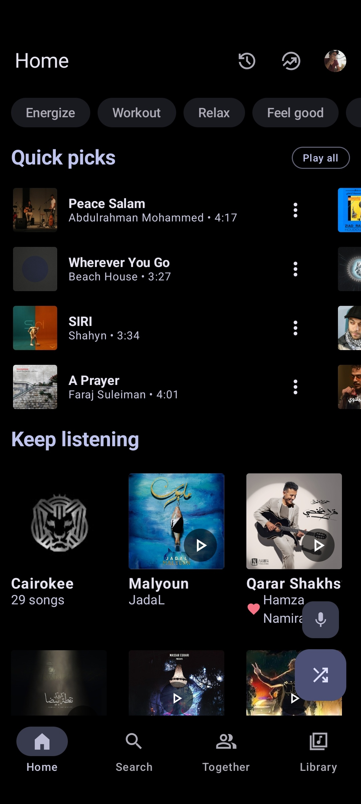
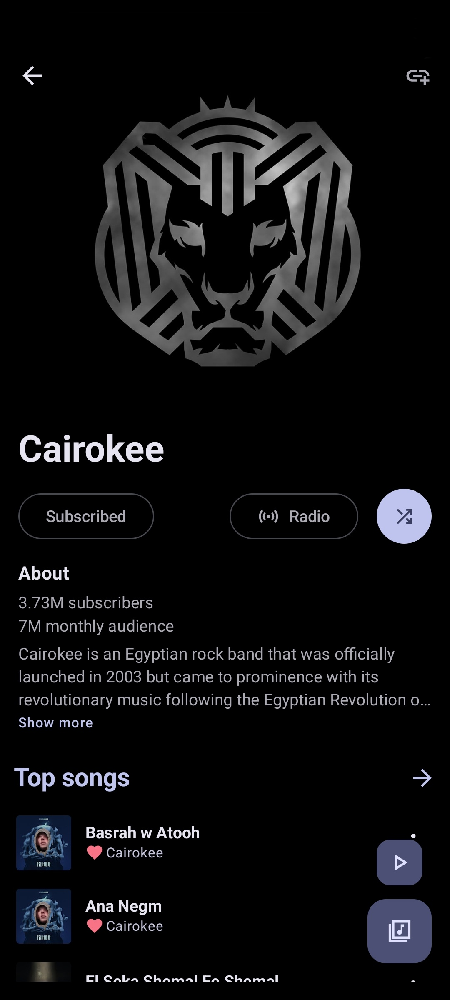
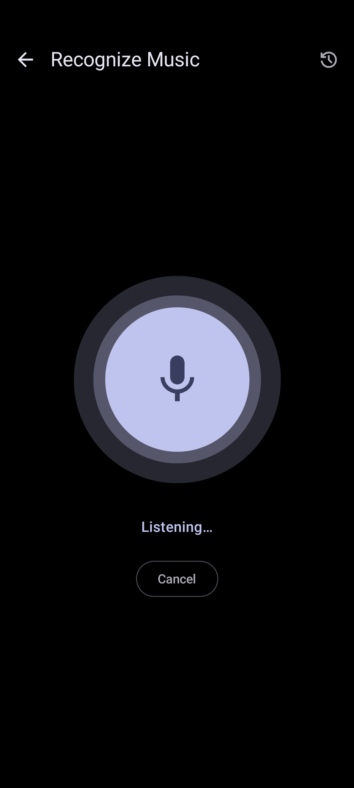
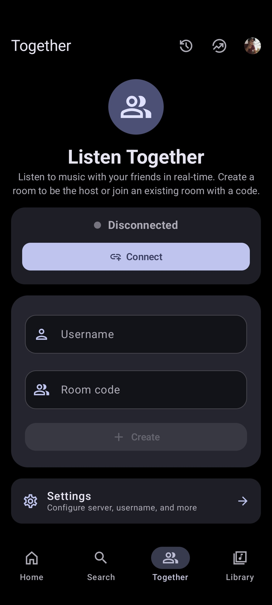
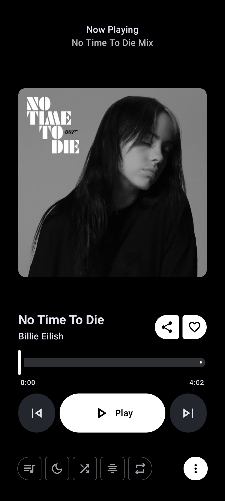
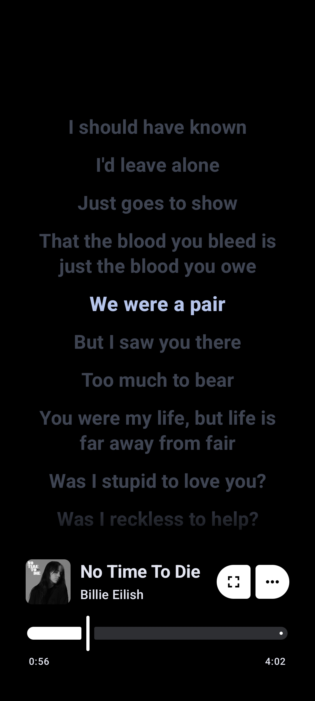

<div align="center">


# 🎵 RAGG

### A Premium, High-Fidelity YouTube Music Client for Android

*Experience music with beautiful aesthetics, high performance, and absolute privacy.*

---

[](https://github.com/Raj121raj/-RAAG-Music-Player/releases)
[](https://github.com/Raj121raj/-RAAG-Music-Player/blob/main/LICENSE)
[](https://github.com/Raj121raj/-RAAG-Music-Player/releases)
[](https://dsc.gg/RAGG)
[](https://t.me/RAGGapp)

<br/>

[**Download APK**](#-download-now) • [**Key Features**](#-features) • [**Screenshots**](#-screenshots) • [**FAQ**](#-faq) • [**Translations**](#-translations) • [**Support**](#-support-the-project)

</div>

> [!WARNING]
> **Regional Restriction:** If YouTube Music is unavailable in your country/region, this application requires a **VPN or proxy** connecting to a supported region to stream audio.

---

## 📱 Screenshots

<div align="center">
  <table border="0">
    <tr>
      <td></td>
      <td></td>
      <td></td>
    </tr>
    <tr>
      <td></td>
      <td></td>
      <td></td>
    </tr>
  </table>
</div>

---

## ✨ Features

<table width="100%">
  <tr>
    <td width="50%" valign="top">
      <h3>🎧 Playback</h3>
      <ul>
        <li>Stream any song or video from YouTube Music</li>
        <li>Background playback with full notification controls</li>
        <li>Download &amp; cache songs for offline use</li>
        <li>Automatic silence skipping</li>
        <li>Sleep timer with custom schedules</li>
      </ul>
    </td>
    <td width="50%" valign="top">
      <h3>🔊 Audio Quality</h3>
      <ul>
        <li>Audio normalization &amp; leveling</li>
        <li>Tempo &amp; pitch controls (tape speed effects)</li>
        <li>Integrated high-fidelity parametric Equalizer</li>
      </ul>
    </td>
  </tr>
  <tr>
    <td width="50%" valign="top">
      <h3>🎤 Lyrics &amp; Discovery</h3>
      <ul>
        <li>Live time-synced lyrics with animations</li>
        <li>AI-powered live translation for foreign lyrics</li>
        <li>Personalized Quick Picks based on your history</li>
        <li>Comprehensive search (songs, playlists, videos, albums, artists)</li>
      </ul>
    </td>
    <td width="50%" valign="top">
      <h3>📁 Library &amp; Account</h3>
      <ul>
        <li>Full library &amp; local playlist management</li>
        <li>Import/Export playlists (M3U, CSV)</li>
        <li>Drag-and-drop queue/playlist reordering</li>
        <li>YouTube Music account login &amp; data synchronization</li>
      </ul>
    </td>
  </tr>
  <tr>
    <td width="50%" valign="top">
      <h3>👥 Social Features</h3>
      <ul>
        <li><strong>Listen Together:</strong> Sync playback with friends in real-time</li>
      </ul>
    </td>
    <td width="50%" valign="top">
      <h3>🎨 Customization</h3>
      <ul>
        <li>Modern Material You / Material 3 interface</li>
        <li>Vibrant palettes (19+ color schemes, light/dark/pure-black modes)</li>
        <li>Frosted glassmorphism design elements</li>
        <li>Beautiful Home Screen widget with media controls</li>
      </ul>
    </td>
  </tr>
</table>

---

## 📥 Download Now

### Stable Releases

<table>
  <tr>
    <th align="center" width="25%">Obtainium</th>
    <th align="center" width="25%">IzzyOnDroid</th>
    <th align="center" width="25%">OpenAPK</th>
    <th align="center" width="25%">GitHub Direct</th>
  </tr>
  <tr>
    <td align="center">
      <a href="https://apps.obtainium.imranr.dev/redirect?r=obtainium://add/https://github.com/Raj121raj/-RAAG-Music-Player">
        
      </a>
    </td>
    <td align="center">
      <a href="https://apt.izzysoft.de/fdroid/index/apk/com.RAGG.music">
        
      </a>
    </td>
    <td align="center">
      <a href="https://www.openapk.net/RAGG/com.RAGG.music/">
        
      </a>
    </td>
    <td align="center">
      <a href="https://github.com/Raj121raj/-RAAG-Music-Player/releases/latest/download/RAGG.apk">
        
      </a>
    </td>
  </tr>
</table>

### Nightly Builds

<table>
  <thead>
    <tr>
      <th align="center">Source</th>
      <th align="center">Action Link</th>
    </tr>
  </thead>
  <tbody>
    <tr>
      <td align="center"><strong>GitHub Actions Nightly</strong></td>
      <td align="center">
        <a href="https://nightly.link/Raj121raj/-RAAG-Music-Player/workflows/build/main/app-with-Google-Cast.zip">
          
        </a>
      </td>
    </tr>
  </tbody>
</table>

---

## 💬 FAQ

### Have questions?
Visit our official [**FAQ page**](https://RAGG.cc/#faq) for details on app setup, credentials, and troubleshooting.

---

## 🌐 Translations

We use **Weblate** to localize RAGG. Every translation helps make RAGG accessible to more users worldwide.

<a href="https://hosted.weblate.org/projects/RAGG/">
  
</a>

---

## 💖 Support the Project

RAGG is completely free and open-source. If you enjoy the app, consider supporting the developers!

### Monero (XMR)


```text
44XjSELSWcgJTZiCKzjpCQWyXhokrH9RqH3rpp35FkSKi57T25hniHWHQNhLeXyFn3DDYqufmfRB1iEtENerZpJc7xJCcqt
```

### Buy Me a Coffee
<a href="https://www.buymeacoffee.com/mostafaalagamy">
  
</a>

---

## 🤝 Special Thanks

RAGG stands on the shoulders of incredible open-source projects:

### Core Inspirations
*   **InnerTune** (by [Zion Huang](https://github.com/z-huang) &amp; [Malopieds](https://github.com/Malopieds))
*   **OuterTune** (by [Davide Garberi](https://github.com/DD3Boh) &amp; [Michael Zh](https://github.com/mikooomich))

### Libraries & Services
*   **Kizzy** (by [dead8309](https://github.com/dead8309/Kizzy)): Discord Rich Presence integration
*   **Better Lyrics**: Word-by-word synced lyrics and YouTube Music parser
*   **SimpMusic Lyrics**: Synced lyrics API integration
*   **metroserver**: Real-time Listen Together backend
*   **MusicRecognizer**: Shazam integration

---

## 👥 Contributors

Thank you to everyone who has contributed to RAGG!

<a href="https://github.com/Raj121raj/-RAAG-Music-Player/graphs/contributors">
  
</a>

---

## ⚖️ Disclaimer

This project is **not affiliated with, authorized, or endorsed by** YouTube, Google LLC, or any of their subsidiaries. All trademarks and registered trademarks are the property of their respective owners.

---

<div align="center">
  <sub>Made with ❤️ by <a href="https://github.com/mostafaalagamy">Mo Agamy</a>. Maintained &amp; improved by <a href="https://github.com/Raj121raj">Raj121raj</a>.</sub>
</div>
